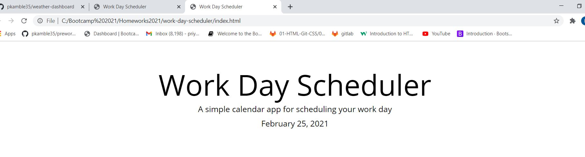

# work-day-scheduler

Given a schedular where i had updated a Date at the top, on a daily basis.

User will the specific time that would be 9-5 where they can block their time.

As the time passes the timing on the schedule will turn Grey as a Past, Red as a Present, and Green as a Future.

User can enter an event and click the save button for that timeblock.

THEN the text for that event is saved in local storage and can refresh the page.

Deployed Link :  https://pkamble35.github.io/work-day-scheduler/

