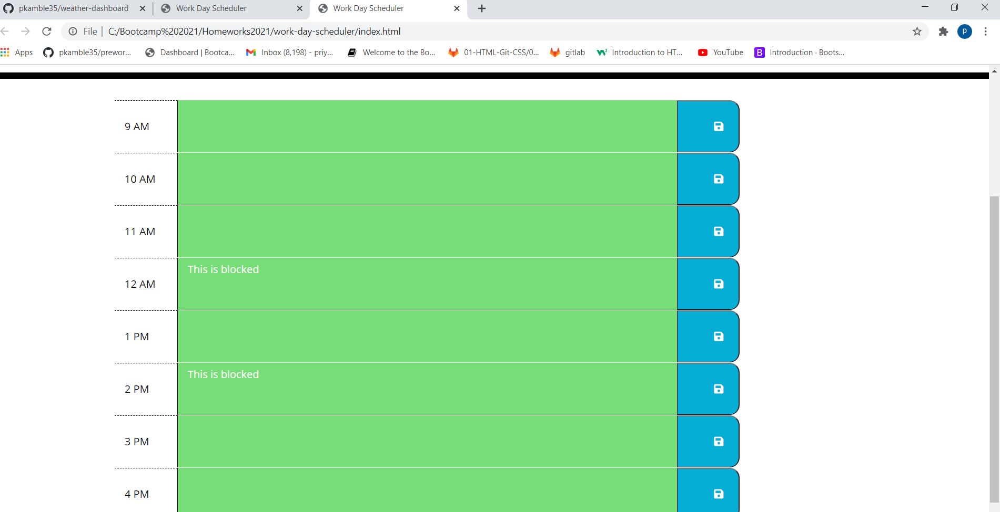

# Work Day Scheduler

Given a schedular where i had updated a Date at the top, on a daily basis.

User will the specific time that would be 9-5 where they can block their time.

As the time passes the timing on the schedule will turn Grey as a Past, Red as a Present, and Green as a Future.

User can enter an event and click the save button for that timeblock.

THEN the text for that event is saved in local storage and can refresh the page.

Technologies:
  1. HTML
  2. CSS
  3. Javascript
  4. Jquery

Deployed Link :  https://pkamble35.github.io/work-day-scheduler/

#License
The MIT License (MIT)

Copyright (c) 2021 Priyanka Damodar

Permission is hereby granted, free of charge, to any person obtaining a copy of this software and associated documentation files (the "Software"), to deal in the Software without restriction, including without limitation the rights to use, copy, modify, merge, publish, distribute, sublicense, and/or sell copies of the Software, and to permit persons to whom the Software is furnished to do so, subject to the following conditions:

The above copyright notice and this permission notice shall be included in all copies or substantial portions of the Software.

THE SOFTWARE IS PROVIDED "AS IS", WITHOUT WARRANTY OF ANY KIND, EXPRESS OR IMPLIED, INCLUDING BUT NOT LIMITED TO THE WARRANTIES OF MERCHANTABILITY, FITNESS FOR A PARTICULAR PURPOSE AND NONINFRINGEMENT. IN NO EVENT SHALL THE AUTHORS OR COPYRIGHT HOLDERS BE LIABLE FOR ANY CLAIM, DAMAGES OR OTHER LIABILITY, WHETHER IN AN ACTION OF CONTRACT, TORT OR OTHERWISE, ARISING FROM, OUT OF OR IN CONNECTION WITH THE SOFTWARE OR THE USE OR OTHER DEALINGS IN THE SOFTWARE.
